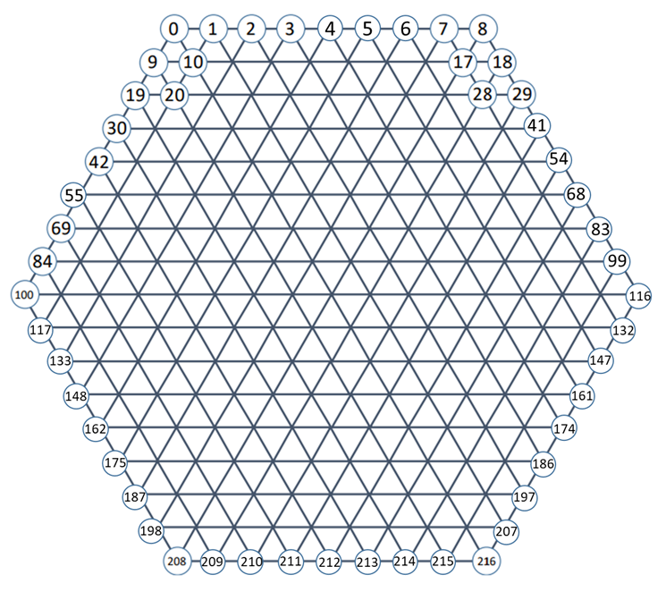

A varient of [**Gomoku**](https://en.wikipedia.org/wiki/Gomoku) (Five in a Row) client featuring a powerful AI written in `C++` and `python`.

There are two main components in this project:

* A strong AI player based on Minimax with α-β pruning, alongside many performance optimisations ([strong_ai](strong_ai))
* A weak AI player based on Minimax with α-β pruning ([weak_ai/cpp](weak_ai/cpp))
* A weak AI player based on Minimax with α-β pruning ([weak_ai/python](weak_ai/python))

##  Gomoku Board
<p aligm="center"></p>


## Install
```
  cd strong_ai/
  make
  ./play
``` 

